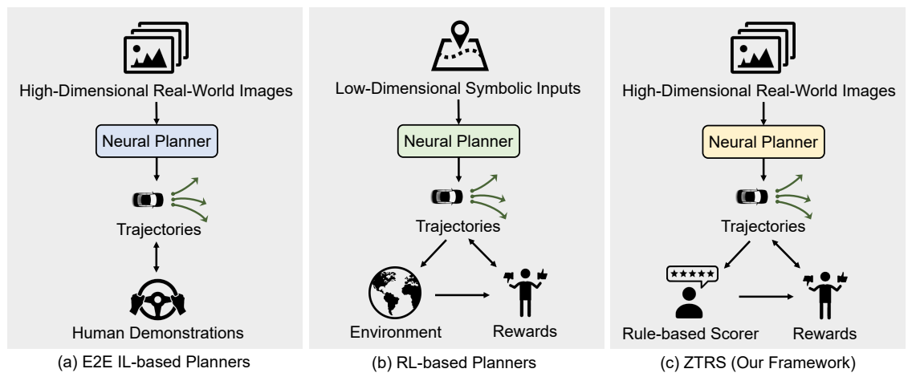

# ZTRS: Zero-Imitation End-to-end Autonomous Driving with Trajectory Scoring

### [arXiv](https://arxiv.org/abs/2510.24108)

This is the official repository of ZTRS, the first end-to-end planning framework that uses rule-based rewards instead of human demonstrations for training.
Code will be available soon!

## Getting Started
Please refer to [install.md](docs/install.md) for downloading the dataset and installing the devkit.

## Model Checkpoints
| Model                                                            |                                   Resolution                                    | Vocab. Size  |                                    Backbone                                    | EPDMS | Checkpoint                                   |
|:-----------------------------------------------------------------|:----------:|:------------:|:------------------------------------------------------------------------------:|:-----:|:----------:|
| [ZTRS](navsim/planning/script/config/common/agent/ztrs_vov.yaml) |512x2048|      -       |[V2-99](https://drive.google.com/file/d/1gQkhWERCzAosBwG5bh2BKkt1k0TJZt-A/view) | 45.5  |     [Link](https://huggingface.co/Zzxxxxxxxx/ZTRS/blob/main/ztrs_vov.ckpt)     |

## Training and Inference
Please refer to [ztrs_training.md](docs/ztrs_training.md) and [ztrs_inference.md](docs/ztrs_inference.md) respectively.
[simulation.md](docs/gtrs_simulation.md) provides instructions on collecting your own trajectory statistics.

## Acknowledgement
Many thanks to the following great open-source repositories:
+ [NAVSIM](https://github.com/autonomousvision/navsim)
+ [VAD](https://github.com/hustvl/VAD)
+ [Transfuser](https://github.com/autonomousvision/transfuser)